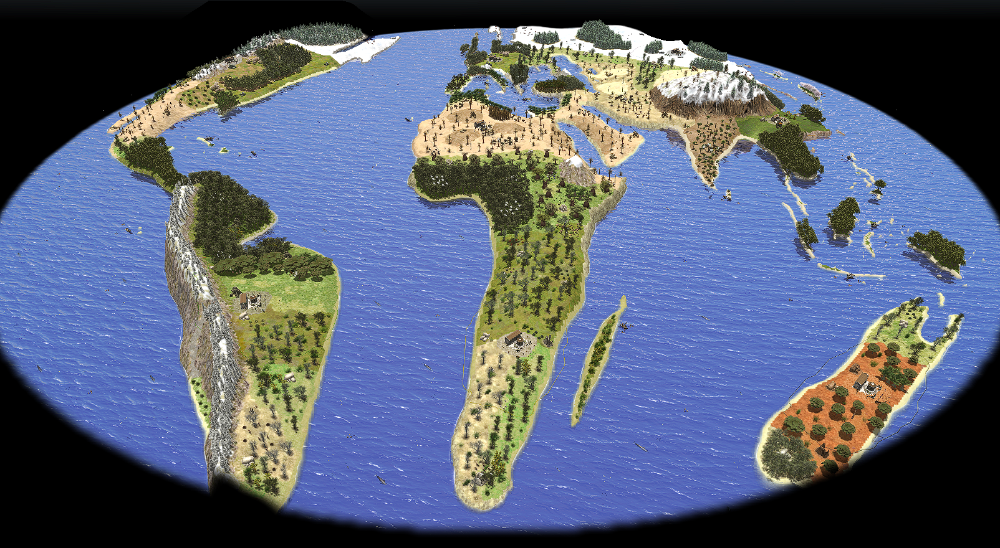
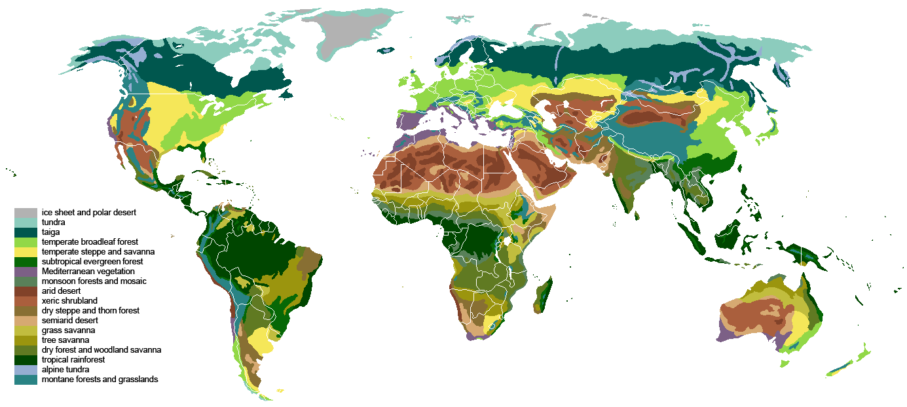

# Continental Maps fo 0 A.D.

## North and Central America

Each player near the ocean has a dock.
The map has four main biomes:
    
1. Polar in the North, corresponding to Canada and North of USA;
2. Temperate in the Center, corresponding to East cost, and central part of USA;
3. Desertic in the South, corresponding to Mexic and South-West of USA;
4. Tropical in Florida, Yucatan peninsula and Cuba island.

A civic center can be build on Yucatan and Cuba, while you can't on Ande and Appalacchia mountains.
On Rocky Mountains there is a passage to make map funnier.

## South America

Each player near the ocean has a dock.
The map has four main biomes:
    
1. Subtropical in the North and South of Amazon rainforest, corresponding to South of Brazil and North of the continent;
2. Tropical in the Amazon rainforest, corresponding to North of Brazil and Perù;
3. Desertic in the South, corresponding to Argentina and North of Chile;
4. Temperate in South of Chile.

There are the main river of South America, such Rio of Amazzones. Sadly, due to limitation of the game engine the water level is standard so the river looks like a canyon.

It's possible to access to Pacific Ocean through Chile.

## World

It was a <b>really really big work</b> and obviously the Earth is deformed, more strongly to the poles, but I used a [sinusoidal projection](https://en.wikipedia.org/wiki/Sinusoidal_projection) to preserve the area of the continents. 

<i>Pay attention: to give more important to inhabited continents I changed a bit the projection and removed the Earth poles.</i>

This is my most ambitious project and I was almost loyal to real biomes. It's impossible to list them all. I based my work on this map: 

<i> Source: [Wikipedia](https://en.wikipedia.org/wiki/Biome#/media/File:Vegetation.png) </i>

There are lots of resources and maybe too much trees, but I created this map to be rich and create epic battles.
