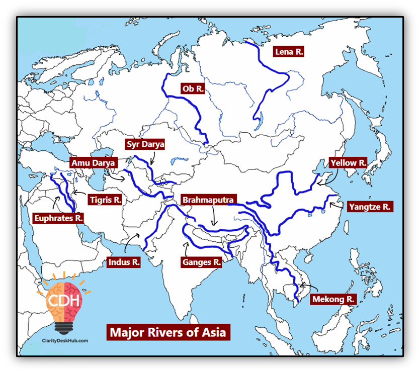
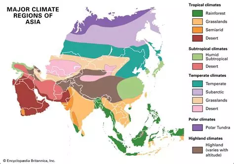

## Asia

This map has 1024x1024 size. The first step was to add rivers correctly without geo-reference. I used this guide:

To make the map strategically more captivating, rivers aren't crossable, but there are some bridges.

As always, I try to stay loyal to real geography, so I used this map for a crude first step:

and the I refine it with Koppen-Geiger classification.

I used ClaudeAI for flora and fauna. I sent screenshot of available entities in the game and it returned best choice for each biome and zone. 

### Fauna
- Arabian peninsula
    - gaia/fauna_camel / fauna_camel_trainable
    - gaia/fauna_gazelle
    - gaia/fauna_goat / fauna_goat_trainable
    - gaia/fauna_donkey
    - gaia/fauna_horse_persian / fauna_horse_marwari
    - gaia/fauna_lion / fauna_lioness
    - gaia/fauna_sheep / fauna_sheep_trainable

    Acceptable with some liberties:
    - gaia/fauna_elephant_north_african 
    - gaia/fauna_crocodile_nile

- Middle East (Syria, Mesopotamia, Persia)
    - fauna_camel / fauna_camel_trainable
    - fauna_gazelle
    - fauna_lion / fauna_lioness
    - fauna_horse_persian
    - fauna_donkey
    - fauna_goat / fauna_goat_trainable
    - fauna_sheep / fauna_sheep_trainable
    - fauna_crocodile_nile (only Mesopotamia/river zones)

- Asia Centrale (steppa, Kazakhstan, Afghanistan)
    - fauna_horse / fauna_horse_breed / fauna_horse_trainable
    - fauna_camel
    - fauna_wolf
    - fauna_sheep
    - fauna_rabbit
    - fauna_deer

- India
    - fauna_elephant_asian / fauna_elephant_asian_infant
    - fauna_tiger
    - fauna_lion (Gujarat)
    - fauna_peacock
    - fauna_cattle_zebu / fauna_cattle_zebu_trainable
    - fauna_horse_marwari
    - fauna_crocodile_nile (indian rivers)
    - fauna_pig
    - fauna_chicken
    - fauna_shark / fauna_whale_fin

- East Asia (China, Korea, Japan)
    - fauna_tiger
    - fauna_deer
    - fauna_boar
    - fauna_rabbit
    - fauna_wolf
    - fauna_pig
    - fauna_chicken
    - fauna_horse
    - fauna_shark / fauna_whale_humpback

- Asiatic South-East (Vietnam, Myanmar, Indonesia)
    - fauna_elephant_asian / fauna_elephant_asian_infant
    - fauna_tiger
    - fauna_crocodile_nile
    - fauna_pig / fauna_pig_flaming / fauna_piglet
    - fauna_chicken
    - fauna_shark / fauna_whale_fin

- Siberia / North Asia
    - fauna_wolf / fauna_wolf_arctic
    - fauna_bear_brown
    - fauna_bear_polar (coste artiche)
    - fauna_walrus
    - fauna_muskox
    - fauna_rabbit
    - fauna_deer
    - fauna_whale_fin / fauna_whale_humpback

- Mongolia / Mongolian steppa
    - fauna_horse / fauna_horse_breed / fauna_horse_trainable 
    - fauna_camel
    - fauna_wolf
    - fauna_deer
    - fauna_rabbit
    - fauna_sheep / fauna_sheep_trainable
    - fauna_goat / fauna_goat_trainable
    - fauna_bear_brown

- Himalayan Plateau / Tibet
    - fauna_horse_pony
    - fauna_goat / fauna_goat_trainable
    - fauna_sheep / fauna_sheep_trainable
    - fauna_wolf
    - fauna_bear_brown
    - fauna_deer
    - fauna_rabbit
    - fauna_cattle_bull / fauna_cattle_cow (there isn't yak)

### Flora
 - Middle East / Arabian Peninsula
    - tree/date_palm / tree/date_palm_dead
    - tree/cretan_date_palm_short / _tall / _patch
    - tree/senegal_date_palm
    - tree/acacia / tree/acacia_large
    - tree/tamarix
    - tree/bush_badlands
    - tree/bush_steppe_01/02/03
    - tree/olive (near Mediterranean sea)
    - tree/carob (near Mediterranean sea)
    - tree/aleppo_pine (Syria)

- Central Asia / Steppa
    - tree/bush_steppe_01/02/03
    - tree/tamarix (near the rivers)
    - tree/poplar / tree/poplar_dead (in valleys)
    - tree/elm (temperate zones)
    - tree/juniper_prickly (near mountains)

- Mongolia
    - tree/bush_steppe_01/02/03
    - tree/fir / tree/fir_winter (taiga)
    - tree/pine / tree/pine_black
    - tree/poplar
    - tree/elm
    - tree/temperate_winter

- Himalayan Plateau / Tibet
    - tree/juniper_prickly
    - tree/fir / tree/fir_sapling / tree/fir_winter
    - tree/pine / tree/pine_black
    - tree/bush_steppe_01/02/03
    - tree/temperate_winter
    - tree/dead / tree/pine_black_dead (for rugged terrain)

- India
    - tree/banyan
    - tree/teak
    - tree/toona
    - tree/palm_areca
    - tree/palm_royal / tree/palm_tropic / tree/palm_tropical
    - tree/date_palm (North India)
    - tree/acacia (Deccan)
    - tree/bush_tropic
    - tree/mangrove (coastes)
    - tree/strangler
    - tree/bamboo / tree/bamboo_dragon / tree/bamboo_single

- East Asia (China, Korea, Japan)
    - tree/bamboo / tree/bamboo_dragon / tree/bamboo_single
    - tree/cherry_blossom (Japan)
    - tree/maple / tree/maple_autumn
    - tree/oak / tree/oak_large / tree/oak_aut
    - tree/pine / tree/pine_black
    - tree/fir
    - tree/poplar
    - tree/temperate / tree/temperate_autumn

- Asiatic South-East
    - tree/tropic_rainforest — essenziale
    - tree/banyan
    - tree/strangler
    - tree/mangrove (coste)
    - tree/bamboo / tree/bamboo_dragon
    - tree/teak
    - tree/toona
    - tree/palm_royal / tree/palm_tropical / tree/palm_tropic
    - tree/palm_areca
    - tree/bush_tropic

- Siberia / North Asia
    - tree/fir / tree/fir_winter / tree/fir_sapling
    - tree/pine / tree/pine_black / tree/pine_w
    - tree/temperate_winter
    - tree/euro_birch — la betulla è dominante in Siberia
    - tree/poplar / tree/poplar_dead
    - tree/elm
    - tree/dead — per zone permafrost

- Persia
    - tree/bush_badlands
    - tree/bush_steppe_01/02/03
    - tree/tamarix
    - tree/date_palm / tree/date_palm_dead
    - tree/oak / tree/oak_large
    - tree/temperate
    - tree/temperate / tree/temperate_autumn
    - tree/euro_birch
    - tree/maple
    - tree/elm
    - tree/poplar
    - tree/cypress / tree/cypress_wild