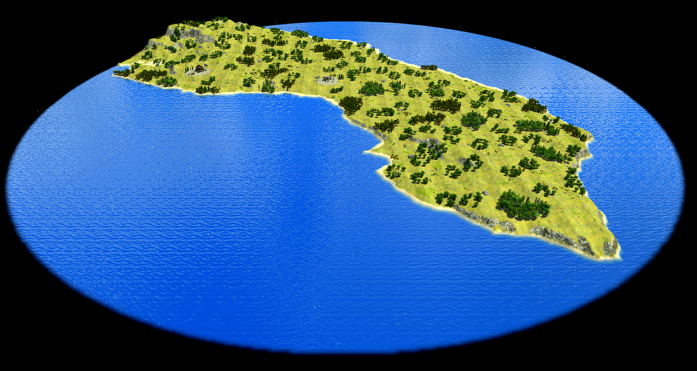
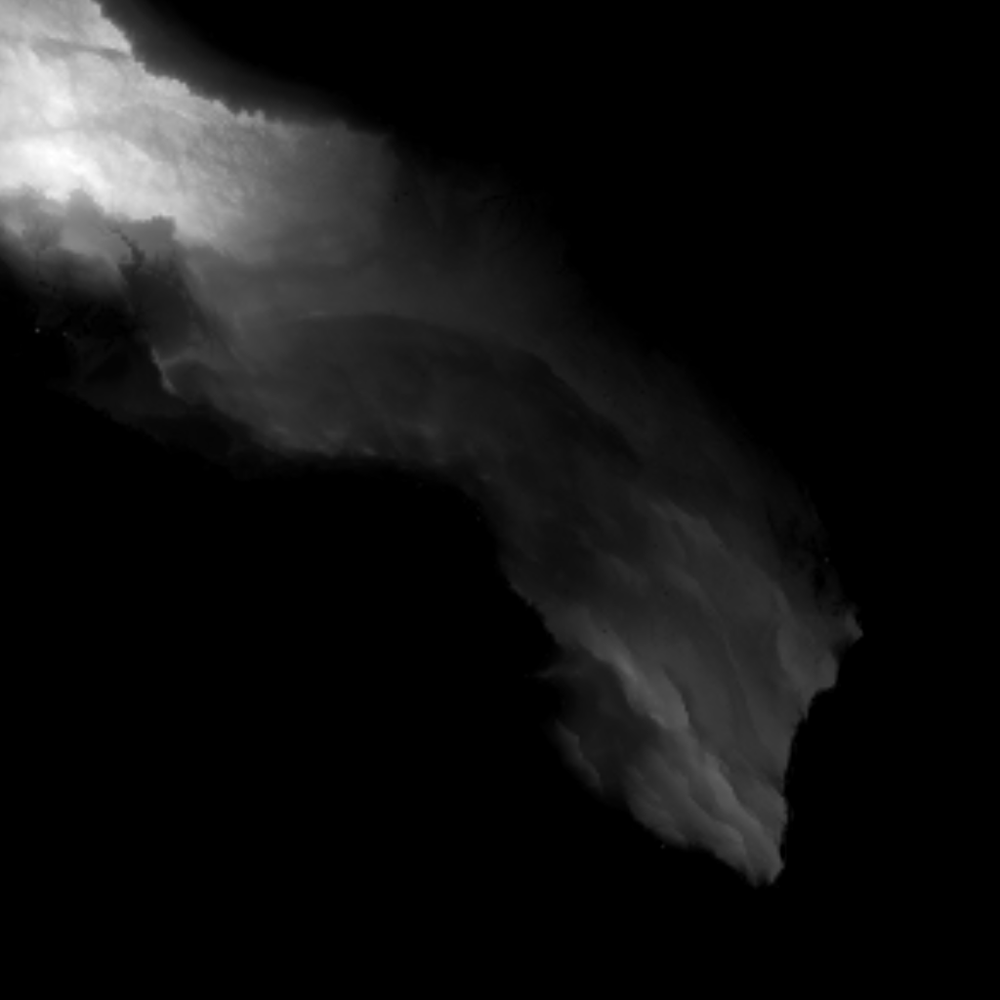

## historical Calabria (now Salento)

### History
This map depicts Salento, the heel of Italy, the narrow limestone peninsula forming the southeastern tip of Puglia. 
The filename (calabria.js, calabria.png) is a deliberate nod to the region's older name: 
in antiquity, "Calabria" referred specifically to this peninsula, not to the toe of Italy that carries the name today. 
What we now call Calabria was Roman Bruttium; 
the name only shifted west centuries later, after the Byzantines lost the heel to the Lombards and carried the administrative title "Calabria" with them to the territory they retained. Salento inherited a new name: Terra d'Otranto, later Salento, while the toe kept the old one.

### Map
The heightmap comes from real elevation data, imported via Heightmapper, centered on the peninsula around the area southeast of Taranto/Brindisi down toward Lecce and the tip at Santa Maria di Leuca.

Geographically, Salento is about as different from the rest of Italy's spine as it's possible to be. Where the Apennines dominate most of the peninsula with steep folded mountains, Salento is a low, flat karst plateau, rarely exceeding 200 meters, wedged between two seas: the Adriatic to the east and the Ionian to the west, close enough together that from many points on the peninsula you're never more than a short walk from open water on one side or the other. There are no real mountain ranges, only shallow undulations and the occasional low ridge (the Serre Salentine), so the terrain reads as gentle almost everywhere.

Biome-wise, the whole map uses a single zone (generic/aegean) the closest match in 0 A.D.'s roster to a warm Mediterranean coastal climate: sun-bleached ground textures, sparse scrubby vegetation, and terrain that reads as arid-adjacent rather than lush. On top of the standard forest generation, a dedicated createObjectGroups pass adds olive trees (gaia/tree/olive) in scaled quantity (scaleByMapSize(25, 100)), which is the single most locally accurate touch on the whole map: Salento's landscape is genuinely dominated by ancient olive groves, some of the oldest cultivated olive trees in Europe.