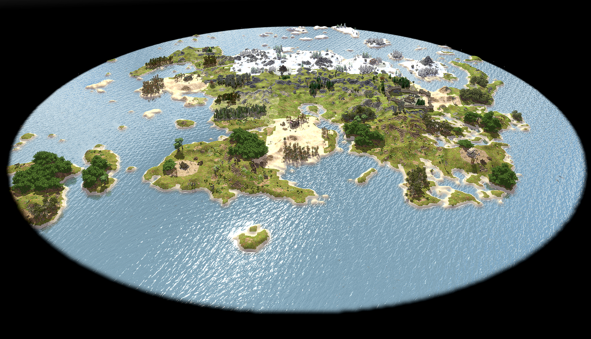
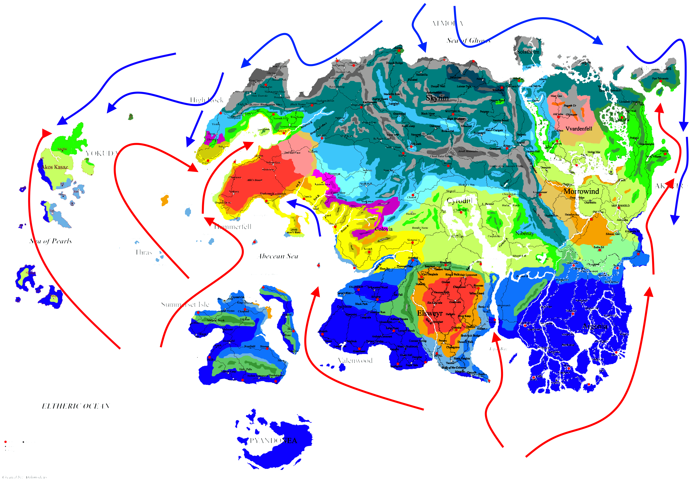

## Tamriel

I've been working on a custom random map for 0 A.D. inspired by the continent of Tamriel. 
It uses a real heightmap to recreate the shape of the landmass, then splits it into distinct climate zones that roughly mirror the regions from the source material: from snowy tundra in the north, to alpine terrain, arid deserts, temperate woodlands, and tropical jungle in the south.

The heightmap source is: 

https://www.nexusmods.com/skyrimspecialedition/mods/573

And I used a simplified version of this work for biomes: 

https://www.reddit.com/r/teslore/comments/7zifph/climate_map_of_tamriel_including_ocean_currents/?tl=it&utm_source=embedv2&utm_medium=post_embed&embed_host_url=https%3A%2F%2Fwildfiregames.com%2Fforum%2Findex.php

I want to thanks both the creators of these artworks.

### Biomes

- arctic: North of Skyrim, North and Center part of Vvardenfell;
- alpine: South of Skyrim, North of Hight Rock and the mountains between Cyrodiil and Morrowind;
- temperate: South of Hight Rock, East of Cyrodiil, East and North of Morrowind and the border between Morrowind and Argonia;
- sahara: Hammerfell, Elsweyr and East of Morrowind;
- aegean: West of Cyrodiil;
- india (tropical): Summerset, Valenwood, Argonia and the South of Elsweyr.

