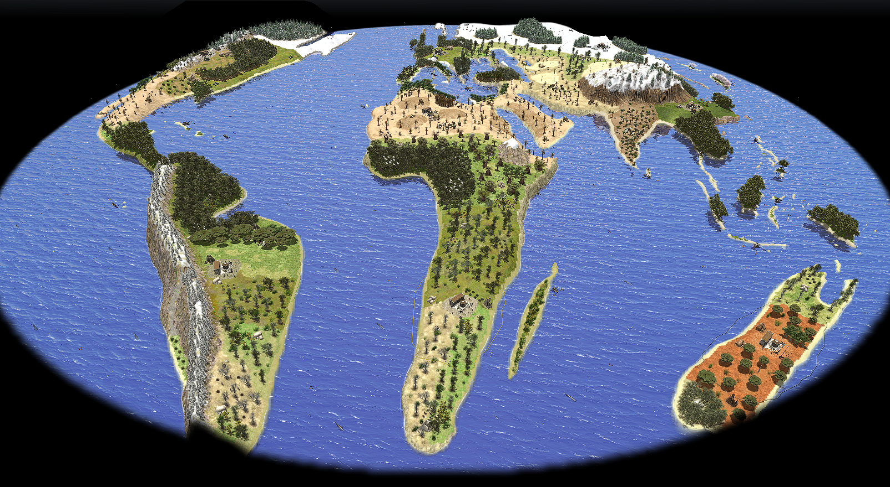
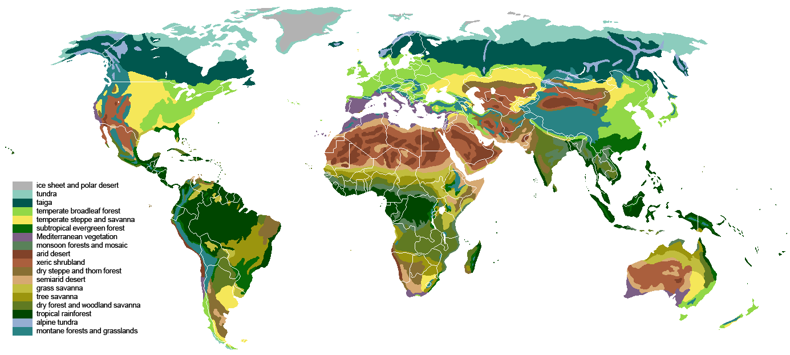

## World

It was a <b>really really big work</b> and obviously the Earth is deformed, more strongly to the poles, but I used a [sinusoidal projection](https://en.wikipedia.org/wiki/Sinusoidal_projection) to preserve the area of the continents. 

<i>Pay attention: to give more important to inhabited continents I changed a bit the projection and removed the Earth poles.</i>

This is my most ambitious project and I was almost loyal to real biomes. It's impossible to list them all. I based my work on this map: 

<i> Source: [Wikipedia](https://en.wikipedia.org/wiki/Biome#/media/File:Vegetation.png) </i>

There are lots of resources and maybe too much trees, but I created this map to be rich and create epic battles.
