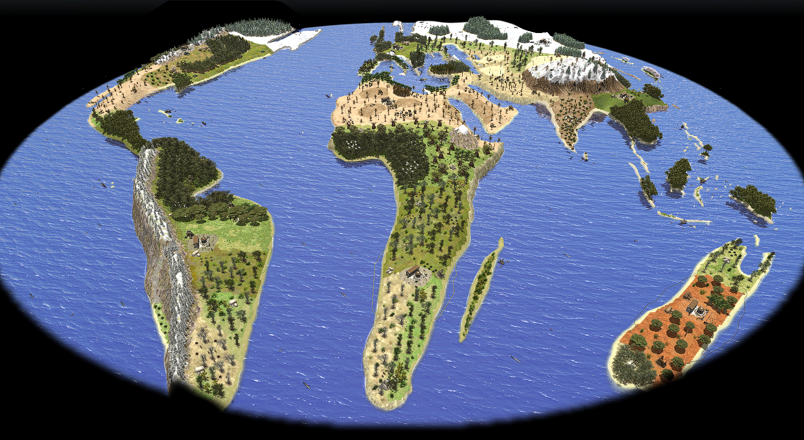
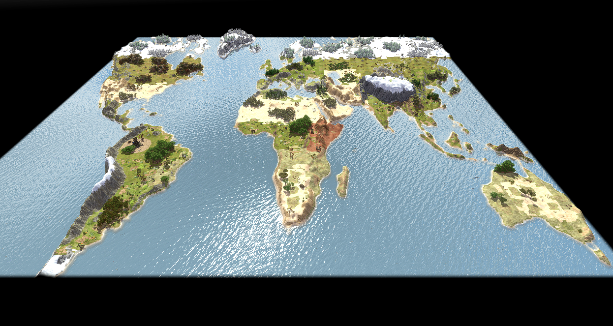
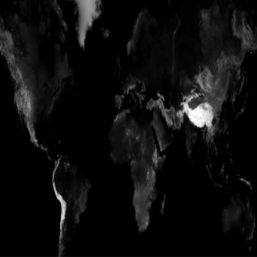

## World - Skirmish

It was a <b>really really big work</b> and obviously the Earth is deformed, more strongly to the poles, but I used a [sinusoidal projection](https://en.wikipedia.org/wiki/Sinusoidal_projection) to preserve the area of the continents. 

<i>Pay attention: to give more important to inhabited continents I changed a bit the projection and removed the Earth poles.</i>

This is my most ambitious project and I was almost faithful to real biomes. There are far too many to list individually. I based my work on this map: 

<i> Source: [Wikipedia](https://en.wikipedia.org/wiki/Biome#/media/File:Vegetation.png) </i>

There are lots of resources and maybe too much trees, but I created this map to be rich and create epic battles.

## World - Random

Terrain comes from a pre-authored heightmap image with mercator projection, then resized in a square after the remotion of the poles.

### Biome Zone System

This is the actual design problem the map is solving: 0 A.D.'s biome system was never built for a whole-Earth map, so there's no way to derive 20+ realistic climates automatically.

The Whittaker biome/vegetation map was used as ground truth. Each real-world climate region was translated into a rectangle in fractional map space.

Use of 0 A.D. biomes:
- generic/india stands in for tropical/equatorial rainforest belts (Amazon basin, Congo, Southeast Asia), the closest available "hot and green" biome, despite the geographic mismatch of the name.
- generic/nubia covers transitional arid-to-savanna zones (e.g. the Sahara/Sahel southern border) where neither pure desert nor pure savanna textures read correctly.
- generic/aegean is reused for Mediterranean Europe generally, not just the Aegean specifically, because it's the only biome with the right mix of terrain and vegetation density for that climate band.
- generic/steppe covers both the Eurasian steppe belt and Mongolia, geographically distinct regions that share enough visual/gameplay characteristics to justify one biome.
There is no dedicated tundra biome, so generic/arctic and generic/autumn were pushed further from their literal names to cover cold-but-not-frozen zones (e.g. land_fire/southern South America uses generic/arctic, which is a naming leftover from iteration rather than a literal claim about Tierra del Fuego's climate).

Real climate zones don't follow straight lines, but RectPlacer only draws rectangles. Where one geographic area contains two climates the rectangle grid can't separate.
Most notably EMEA (Sahara sitting directly south of Mediterranean Europe in the same longitude band) and Southern Africa/Australia (savanna vs. desert at overlapping latitudes)
The region was manually split into two adjacent rectangles with hand-tuned boundaries, rather than solved generally. This is the main source of fragility: any change to the projection or heightmap shifts real coastlines relative to these fixed rectangles, and the split points would need to be redone by hand.

Because zone edges are hard rectangle boundaries, a separate pass (createLayeredPatches, covered in the pipeline below) blends textures across those edges afterward at multiple scales; the zone system itself produces sharp borders by design, and softening is deferred to a later, independent step rather than baked into the zone definitions.

### Known Limitations
Zone constraint fields are all no-ops; boundaries are pure rectangles, softened only by the border-fuzzing pass, not by the zone logic itself.
Lighting/water/fog are global, not per-zone: a desert base and an arctic base share the same sun angle.
